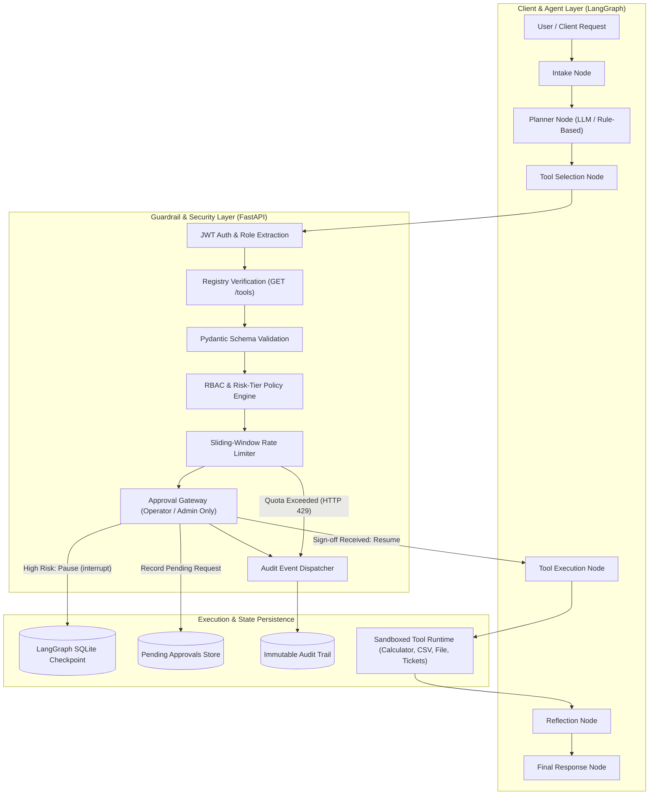

<div align="center">

# Permissioned Tool-Using Agent Sandbox
### Governed Multi-Tool Agent Runtime with Deterministic RBAC, Rate Limiting & Human-in-the-Loop Approval

[](https://www.python.org/)
[](https://fastapi.tiangolo.com/)
[](https://langchain-ai.github.io/langgraph/)
[](https://docs.pydantic.dev/)
[](https://jwt.io/)
[](https://docs.pytest.org/)

<p align="center">
  A security-hardened agent environment where an LLM can plan and use tools (sandboxed file inspection, data calculations, CSV aggregation, and ticketing APIs), but every invocation is strictly gated by role-based authorization, risk classification, sliding-window rate limits, and cryptographic audit logs. Built on an explicit state machine that supports persistent pause-and-resume for human-in-the-loop approvals across distinct processes.
</p>

[System Architecture](#system-architecture) • [Governance & Multi-Tier RBAC](#governance--multi-tier-rbac) • [Platform Modules](#key-platform-capabilities) • [Setup & Execution Guide](#cross-platform-setup--execution-guide) • [API Reference](#api-reference) • [License](#license)

---

</div>

## System Architecture

The core tenet of this sandbox is simple: **the model proposes, the system disposes**. The LLM is treated as an untrusted reasoning engine whose proposed actions must pass through deterministic policy gates before execution is ever permitted.



---

## Key Platform Capabilities

| Module | Core Functionality | Security & Operational Value |
| :--- | :--- | :--- |
| **Tool Registry & Schemas** | Static catalog of verified tools exposing input/output JSON schemas, risk tiers, and role limits. | Eliminates blind execution by enforcing typed Pydantic contracts on all arguments before calling tools. |
| **Role-Based Access Control** | Token-level verification mapping callers to Viewer, Analyst, Operator, or Admin tiers. | Decouples permissions from model prompt instructions; authorization lives entirely in system code. |
| **Risk-Tier Policy Engine** | Hierarchical ceilings (Low, Medium, High) matched against tool risk categories. | Restricts destructive tools to elevated roles regardless of how persuasively the LLM reasons. |
| **Sliding-Window Rate Limiter** | In-memory 60-second sliding counters enforcing call velocity per tool and per role. | Prevents runaway agent loops, abusive bursts, and denial-of-service against downstream APIs. |
| **Human-in-the-Loop Gateway** | Real process pause using LangGraph state checkpointing and isolated approval queues. | High-risk actions halt and survive process restarts until explicitly approved or rejected by an operator. |
| **Immutable Audit Logging** | Complete telemetry capturing timestamps, user roles, arguments, decisions, and latencies. | Full post-mortem traceability answering exactly why an action was executed, blocked, or altered. |

---

## Governance & Multi-Tier RBAC

Every inbound tool proposal is evaluated against the caller's verified JWT role claims. The system defines four hierarchical tiers with strict risk ceilings:

```
                            [ LEVEL 1: ADMIN ]
                                    |
                            [ LEVEL 2: OPERATOR ]
                                    |
                            [ LEVEL 3: ANALYST ]
                                    |
                            [ LEVEL 4: VIEWER ]
```

| Role & Tier | Maximum Allowed Risk | Permitted Operations | Human Approval Rights | Rate Limit Tier |
| :--- | :---: | :--- | :---: | :---: |
| **Admin** | High | System administration, policy overrides, all tools | Full Approval Authority | Highest |
| **Operator** | High | Ticket management, infrastructure operations, all tools | Full Approval Authority | Standard Operations |
| **Analyst** | Medium | CSV datasets, data aggregation, math, search, file reading | None (Restricted) | Analytical Quota |
| **Viewer** | Low | Sandboxed file reading, basic math, mock search index | None (Restricted) | Minimal Read-Only |

---

## Starter Tool Specifications

Every tool available to the agent runtime is statically registered with typed schemas and operational policies:

| Tool Identifier | Risk Classification | Permitted Roles | Requires Human Sign-Off | Rate Limit (Calls / Min) | Intended Workflow |
| :--- | :---: | :--- | :---: | :--- | :--- |
| `calculator` | Low | Viewer, Analyst, Operator, Admin | No | Viewer: 30 / Analyst: 60 / Operator: 60 / Admin: 120 | Evaluates mathematical expressions safely. |
| `file_reader` | Low | Viewer, Analyst, Operator, Admin | No | Viewer: 30 / Analyst: 60 / Operator: 60 / Admin: 120 | Reads sandboxed documentation from a verified folder. |
| `mock_search` | Low | Viewer, Analyst, Operator, Admin | No | Viewer: 20 / Analyst: 40 / Operator: 40 / Admin: 80 | Queries stubbed web knowledge index. |
| `csv_query` | Medium | Analyst, Operator, Admin | No | Analyst: 20 / Operator: 30 / Admin: 60 | Performs structured lookups across business CSV datasets. |
| `create_ticket` | High | Operator, Admin | Yes | Operator: 10 / Admin: 20 | Submits incident tickets to external ticketing systems. |

---

## Cross-Platform Setup & Execution Guide

Follow these instructions to run the sandbox and its test suite on any Windows, macOS, or Linux system.

### Prerequisites

- **Python 3.11+** installed and added to your system PATH
- **Git**

### 1. Clone the Repository
```bash
git clone https://github.com/Fierywave/agent-sandbox.git
cd agent-sandbox
```

### 2. Configure Virtual Environment

#### On Windows (PowerShell)
```powershell
py -3.13 -m venv .venv
.\.venv\Scripts\Activate.ps1
```

#### On macOS / Linux (Bash or Zsh)
```bash
python3 -m venv .venv
source .venv/bin/activate
```

### 3. Install Unified Dependencies
```bash
pip install -r requirements.txt
```

### 4. Run the Full Test Suite
The repository includes comprehensive test suites covering shared contracts, Guardrail RBAC and rate limiting, and LangGraph persistent state pause/resume:

```bash
python -m pytest tests/ -v
```

Expected output:
```
tests/test_contracts.py::test_tool_registry_serializes PASSED
tests/test_contracts.py::test_plan_round_trip PASSED
tests/test_contracts.py::test_workflow_state_defaults PASSED
tests/test_contracts.py::test_audit_event_round_trip PASSED
tests/test_track_a_phase1.py::test_create_and_decode_token PASSED
tests/test_track_a_phase1.py::test_issue_test_tokens PASSED
tests/test_track_a_phase1.py::test_require_role_hierarchy PASSED
tests/test_track_a_phase1.py::test_get_tools_matches_contract PASSED
tests/test_track_a_phase1.py::test_permissions_low_risk_all_roles PASSED
tests/test_track_a_phase1.py::test_permissions_medium_risk_rbac PASSED
tests/test_track_a_phase1.py::test_permissions_high_risk_rbac_and_approval PASSED
tests/test_track_a_phase2.py::test_approval_creation_and_listing PASSED
tests/test_track_a_phase2.py::test_approval_rbac_operator_and_admin_only PASSED
tests/test_track_a_phase2.py::test_approval_rejection_flow PASSED
tests/test_track_a_phase2.py::test_rate_limiting_enforcement PASSED
tests/test_track_a_phase2.py::test_audit_logging_and_filtering PASSED
tests/test_track_b_phase1.py::test_calculator_end_to_end PASSED
tests/test_track_b_phase1.py::test_file_reader_end_to_end PASSED
tests/test_track_b_phase2.py::test_create_ticket_pauses_and_resumes PASSED
```

---

## Running the Guardrail API Service

To start the Guardrail governance service locally:

```bash
uvicorn track-a-guardrail.main:app --host 127.0.0.1 --port 8000 --reload
```

Once running, interactive OpenAPI documentation is available at:
`http://127.0.0.1:8000/docs`

---

## API Reference

| HTTP Method | Route | Description | Authorization Requirement |
| :--- | :--- | :--- | :--- |
| `GET` | `/health` | Service health status check | Public |
| `GET` | `/tools` | Returns full registry with input/output schemas | Public |
| `GET` | `/tools/{tool_name}` | Retrieves single tool schema | Public |
| `POST` | `/auth/token` | Issues a signed JWT for testing or service auth | Public |
| `GET` | `/auth/test-tokens` | Returns pre-computed tokens for all 4 roles | Public (Dev Only) |
| `GET` | `/auth/me` | Decodes caller identity and role claims | Authenticated (Bearer Token) |
| `POST` | `/permissions/check` | Evaluates proposed tool call through 6-step gate | Authenticated (Bearer Token) |
| `POST` | `/approvals` | Registers a pending human approval request | Authenticated (Bearer Token) |
| `GET` | `/approvals/pending` | Lists all actions currently awaiting sign-off | Public / Operator |
| `GET` | `/approvals/{id}` | Retrieves details of a specific approval task | Public / Operator |
| `POST` | `/approvals/{id}/approve` | Approves action, permitting agent resumption | Restricted to Operator / Admin |
| `POST` | `/approvals/{id}/reject` | Rejects action, terminating execution cleanly | Restricted to Operator / Admin |
| `GET` | `/audit` | Queries audit trail with user, tool, and decision filters | Public / Auditor |
| `GET` | `/audit/{event_id}` | Retrieves a single immutable audit event | Public / Auditor |

---

## License

MIT License

Copyright (c) 2026 Agent Sandbox Contributors

Permission is hereby granted, free of charge, to any person obtaining a copy
of this software and associated documentation files (the "Software"), to deal
in the Software without restriction, including without limitation the rights
to use, copy, modify, merge, publish, distribute, sublicense, and/or sell
copies of the Software, and to permit persons to whom the Software is
furnished to do so, subject to the following conditions:

The above copyright notice and this permission notice shall be included in all
copies or substantial portions of the Software.

THE SOFTWARE IS PROVIDED "AS IS", WITHOUT WARRANTY OF ANY KIND, EXPRESS OR
IMPLIED, INCLUDING BUT NOT LIMITED TO THE WARRANTIES OF MERCHANTABILITY,
FITNESS FOR A PARTICULAR PURPOSE AND NONINFRINGEMENT. IN NO EVENT SHALL THE
AUTHORS OR COPYRIGHT HOLDERS BE LIABLE FOR ANY CLAIM, DAMAGES OR OTHER
LIABILITY, WHETHER IN AN ACTION OF CONTRACT, TORT OR OTHERWISE, ARISING FROM,
OUT OF OR IN CONNECTION WITH THE SOFTWARE OR THE USE OR OTHER DEALINGS IN THE
SOFTWARE.
